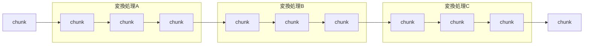
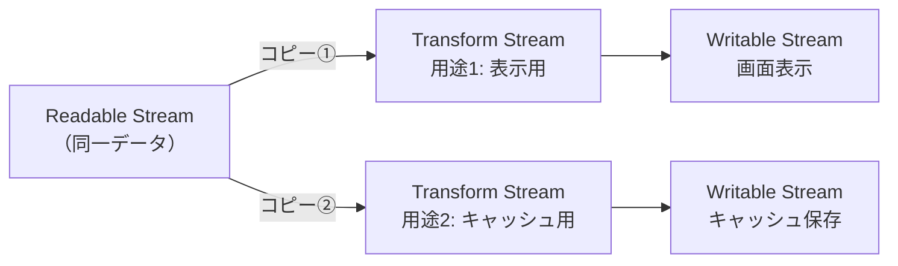

## はじめに
Web Streams APIの概要と使い方について学んだ内容をまとめました。
Node.jsのStreamとの違いや実際の使用例についても触れています。

## ストリームとは
データ出力を**逐次的に効率よく扱う**ためのデータ構造です。
大きなデータ（例：ファイル1つ）を**小さく分割されたチャンク（chunk）**の連続として処理できます。



## ストリームのメリット

### 省メモリ
少しずつメモリに読み込んで処理、処理後は開放されるため、大量データやストリーミング向きです。

### 低遅延
最初のデータは早く処理されるため、リアルタイムな処理が可能です。

## Streams APIの概要
Chunkの連続した流れを扱うAPIで、3種類のストリームがあります。

### ReadableStream（読み込み）
ソース（例：ファイル、ネットワーク）からデータを分割して流します。

```javascript
// 例：Response.body, Blob.stream()
const response = await fetch('/api/data');
const readable = response.body;
```

### TransformStream（変換）
チャンクに対して処理を行います（例：文字コード変換、圧縮）。

```javascript
const transformStream = new TransformStream({
  transform(chunk, controller) {
    // chunkを変換する処理
    controller.enqueue(transformedChunk);
  }
});
```

### WritableStream（書き込み）
ファイルやDBなどに書き込みます。

```javascript
const writableStream = new WritableStream({
  write(chunk) {
    // chunkを書き込む処理
    console.log(chunk);
  }
});
```

## パイプ処理
ストリームをつなげて処理チェーンを作れます。

```javascript
readable
  .pipeThrough(transformStream) // 次の処理に流す
  .pipeTo(writableStream);      // 最終的な出力先に送る
```

## ストリームの分配
1つの `ReadableStream` を複数に分配できます。



```javascript
const [stream1, stream2] = readable.tee();
// stream1は表示用、stream2はキャッシュ用として使用
```

## 主なユースケース

### 大量レコードのDBインポート
少しずつ処理してメモリ消費を抑えることができます。

### AIチャット
生成されたデータをすぐに表示できるため、リアルタイム感のあるUIが実現できます。

## Node.jsとの違い
Node.jsには組み込み `Stream` モジュールがあり、Web Streams APIより先に存在していました。

### Node.js Stream
- `Readable`
- `Writable`
- `Duplex`（読み書き両方）
- `Transform`
- `PassThrough`（何もしない）

### 互換性
Node.js v21でWeb Streams API本体がStableになり、相互変換が可能です。

```javascript
import { Readable } from "node:stream";

// Web Streams API → Node Stream に変換
const nodeStream = Readable.fromWeb(new ReadableStream());

// Node Stream → Web Streams API に変換
const webStream = Readable.toWeb(nodeStream);
```

## Web Streams APIの改善点

### 標準化されていて使いやすい
クロスブラウザ対応で、他のAPI（Fetchなど）とも親和性が高いです。

### モダンな書き方に対応
`EventEmitter` / `callback` ではなく、`Promise` / `async/await` ベースで書けます。

### 型情報（TypeScript対応）
```typescript
// Node：chunkの型がany
// Web Streams：Genericsで明示できる
const readable = new ReadableStream<string>({
  start(controller) {
    controller.enqueue("Hello");
  }
});
```

### エラーハンドリングがラク
Node.jsでは明示的に`.on("error")`と`.destroy()`が必要でしたが、Web Streamsは自動で閉じてくれます。

## まとめ
Web Streams APIは以下の構成要素で構成されています：
- `ReadableStream`（読み込み）
- `TransformStream`（変換）
- `WritableStream`（書き込み）

`pipeThrough()` / `pipeTo()` で段階的に処理でき、Node.jsのストリームと相互変換も可能です。
`async/await` とも組み合わせやすく、直感的で安全なコードが書けるようになりました🙋‍♂️
