## はじめに

分散システムやマイクロサービスアーキテクチャでは、複数のサービスにまたがるトランザクション管理が課題。
従来の単一DBでは実現できていたACID特性が、分散環境では維持が難しくなります。
その解決策の1つであるSagaパターンについて、基本から実装方式、注意点まで解説します。

## ACID特性とは

まず、従来のDBが持つACID特性について確認しましょう。DBはこの4つの特性を持っています。

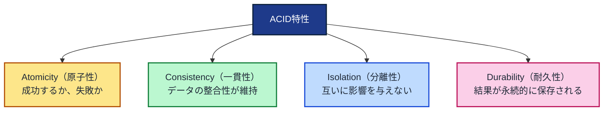

単一DBなら、複数のアクション（処理）が同一DB内なので、エラーが発生してもロールバックしやすい特徴があります。

## 分散システムにおける課題

一方、分散システムでは複数のサービスにまたがるため、DBが分かれています。

例えば、ゴーヤーチャンプルを注文するマイクロサービスを考えてみましょう。

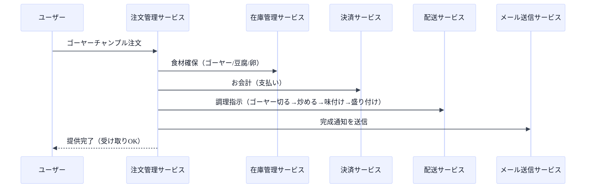

このような複数のサービスにまたがる処理で、Sagaパターンが有用になります。

## Sagaパターンとは

Sagaパターンは、分散システムにおいて使われる手法です。以下のような特徴があります。

- トランザクションをステップごとに分けて、独立した操作を行う
- もし失敗したら、取り消し操作を行う（**補償トランザクション**）
  - 逆向きに実行して初期化するイメージ
- 手動で設計する必要があるため、しっかりとした設計が求められる

## Sagaの2つの実装方式

Sagaパターンには2つの実装方法があります。

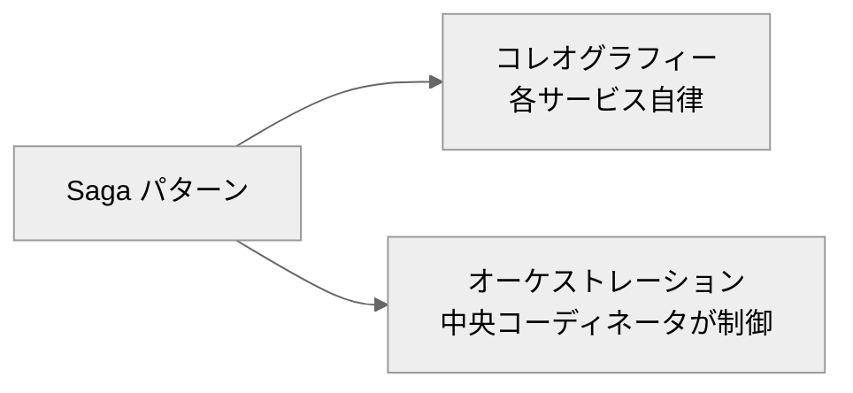

### コレオグラフィー方式

コレオグラフィー方式では、各サービスが自律的に動作します。

- 各サービスが自分の役割を理解していて、イベントに基づいて次のアクションを決める方式
- イベント駆動的なアプローチ
- 柔軟性が高いですが、全体の流れを把握しにくい特徴があります

この方式では、中央の司令塔はいません。各サービスは以下のように動作します。

- イベントを**publish**（発行）
- 必要なイベントを**subscribe**（購読）

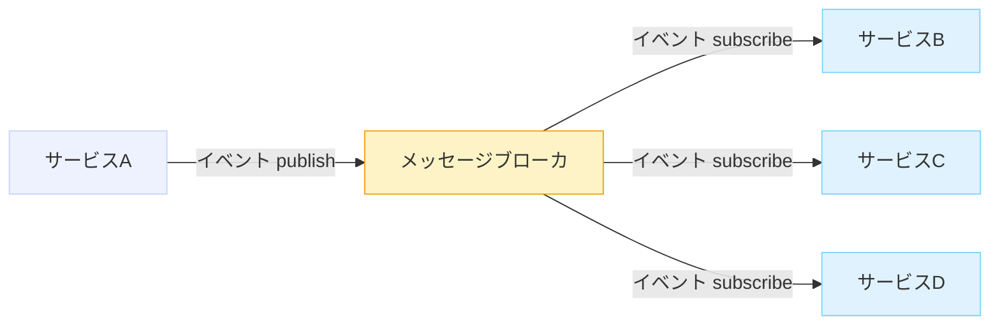

サービスAはサービスB/C/Dを知らず、誰が処理するかはメッセージブローカに任せます。

Sagaで実装すると、以下のような構成になります。

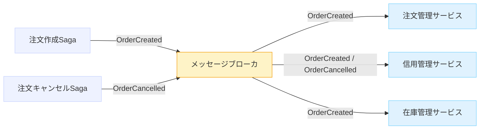

- Sagaは**イベントを発行する役割**を持ちます
- 各サービスはSagaを知りません
- 他のサービスも知りません
- ただ**イベントに反応するだけ**です

注文作成を具体的に見てみましょう。

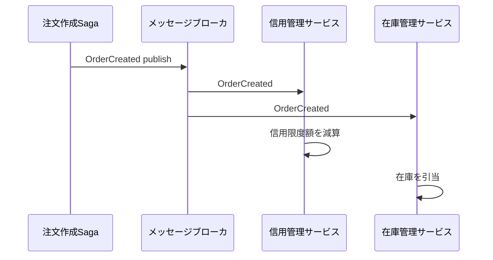

### オーケストレーション方式

オーケストレーション方式では、中央のコーディネーターが全体の流れを制御します。

- 中央で、次はこれをやってと指示する方式
- 中央集権的なアプローチ
- 全体を把握しやすいですが、単一障害点になりやすい特徴があります

オーケストレータ（指揮者）が処理の順番を決めます。

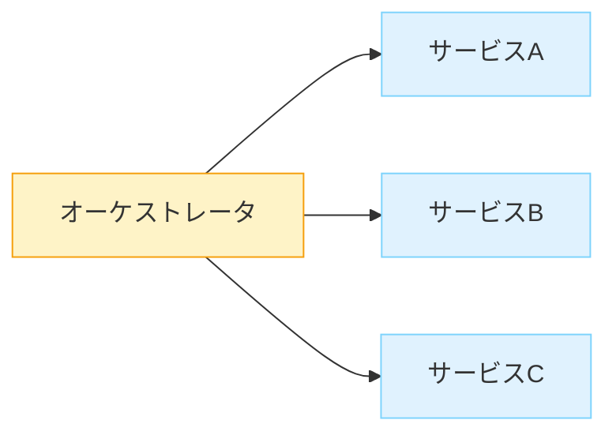

呼び出し元は常にオーケストレータで、サービス同士はつながりません。処理の順序は明示的で全体がわかりやすくなっています。

Sagaで実装すると、以下のような構成になります。

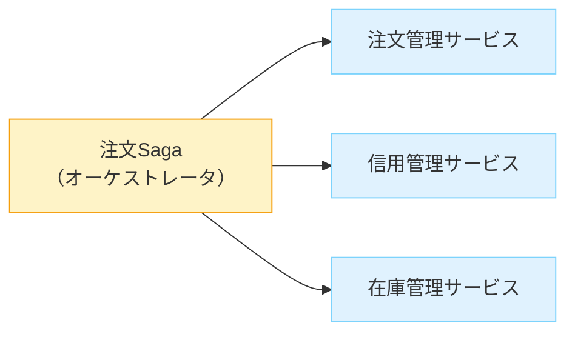

- 注文Sagaが**全体の進行役**を務めます
- 各サービスは
  - Sagaから呼ばれていることは知っていますが、Sagaの詳細は知りません
  - 他のサービスは知りません

より具体的な流れを見てみましょう。

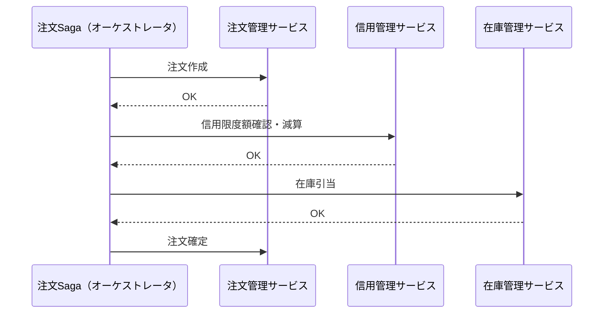

オーケストレーション方式では、処理を並行で行うことができますが、同期的になりやすい傾向があります。一方で、状態遷移が一つに集約されるため、管理がしやすくなります。

## 分散システム特有の問題点

ここで、ACID特性のうち、Isolation（分離性）の欠如によって生じる問題を説明します。

### Lost Update問題

**せっかく書き込んだ値が他のトランザクションによってなかった事にされる**問題です。

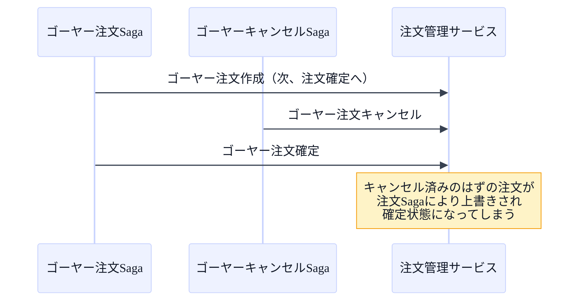

### Dirty Read問題

コミット・ロールバック前の変更内容が他の人にも見える問題です。

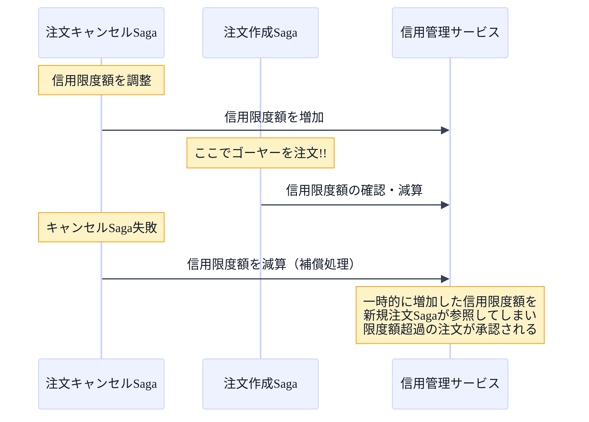

## 従来のトランザクションとSagaの比較

### ACID特性との対比

Sagaパターンでは、ACID特性の各要素を以下のように実現します。

- **Atomicity（原子性）**
  - 成功するか、補償トランザクションによる初期化か、のどちらかになります
- **Consistency（一貫性）**
  - 一連の各ローカルトランザクションで保証されます
- **Durability（耐久性）**
  - ローカルトランザクションのコミットで保証されます
- **Isolation（分離性）**
  - 一連の処理が実行中に、途中の状態が参照できる状態になります
  - 例えば、ゴーヤーの注文は完了しているが、決済がまだの状態で、ユーザーがその状態の在庫を閲覧できてしまうなど

従来のトランザクションとSagaの違いを表にまとめると、以下のようになります。

| 観点 | 従来（ACIDトランザクション） | Saga（分散・マイクロサービス） |
| --- | --- | --- |
| Isolation（分離性） | DBが担保 | **担保しにくい**（途中状態が見える） |
| 失敗時の扱い | rollback（自動・一括） | **補償トランザクション**を設計・実装する |
| 状態の可視性 | 基本「確定した結果」中心 | **途中経過（中間状態）が見えうる** |
| 整合性 | 強整合（ACID） | 最終的整合（最終的に一致する、ACD） |
| 実行方式 | 同期・逐次が多い | 非同期化でスループット向上が狙える |
| 複雑性 | 単一DBでシンプル | **分離するほど複雑性が増える** |

### 2つの実装方式の比較

コレオグラフィーとオーケストレーションの違いを表にまとめると、以下のようになります。

| 観点 | Choreography（コレオグラフィー） | Orchestration（オーケストレーション） |
| --- | --- | --- |
| 制御の中心 | **中央なし**（イベント連鎖で進む） | **中央あり**（オーケストレータが指示） |
| 連携手段 | publish/subscribe（イベント駆動） | 直接呼び出し（順序制御） |
| 全体フローの見通し | 把握しにくい（暗黙の連鎖） | 把握しやすい（明示的手順） |
| 柔軟性/拡張性 | 高い（サービス追加が容易） | 中央変更が必要になりやすい |
| 競合・整合性リスク | **高め**（並行Sagaや一時状態参照の罠） | **低め**（中央が順序と状態を集約） |
| 障害特性 | ブローカ/イベント設計が必要 | オーケストレータが単一障害点になりうる |
| 実装の難所 | 状態・競合・冪等・順序を分散で成立させる | オーケストレータ肥大化、スケール、変更影響範囲 |
| 向いている状況 | 大規模組織・疎結合重視・イベント基盤が強い | 一貫性重視・フローが明確・統制が必要 |

## まとめ

分散システムやマイクロサービスアーキテクチャでは、従来の単一DBでは実現できていたACID特性の維持が難しくなります。特にIsolation（分離性）の欠如は、Lost UpdateやDirty Readといった問題を引き起こします。

Sagaパターンは、この課題を解決するための有効な手法です。トランザクションをステップごとに分割し、失敗時には補償トランザクションで元に戻すことで、分散環境でもトランザクションの一貫性を保つことができます。

実装方式には、コレオグラフィーとオーケストレーションの2つがあります。

- **コレオグラフィー**は、柔軟性が高く、サービスの追加が容易ですが、全体の流れが把握しにくく、競合・整合性リスクが高めです。大規模組織やイベント基盤が強い環境に向いています。
- **オーケストレーション**は、全体の流れが把握しやすく、競合・整合性リスクが低めですが、オーケストレータが単一障害点になりやすい特徴があります。一貫性を重視し、フローが明確な環境に向いています。

どちらの方式を選ぶにせよ、補償トランザクションの設計が鍵となります。分散システムを構築する際は、これらの特性を理解し、適切な設計を行うことが重要です！
